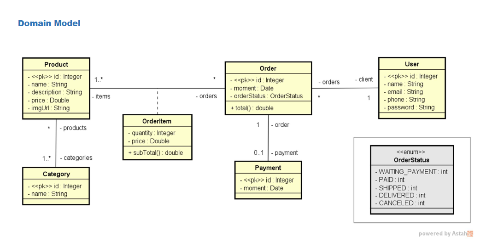
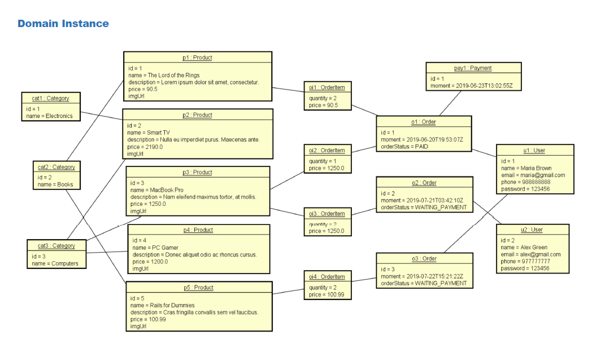
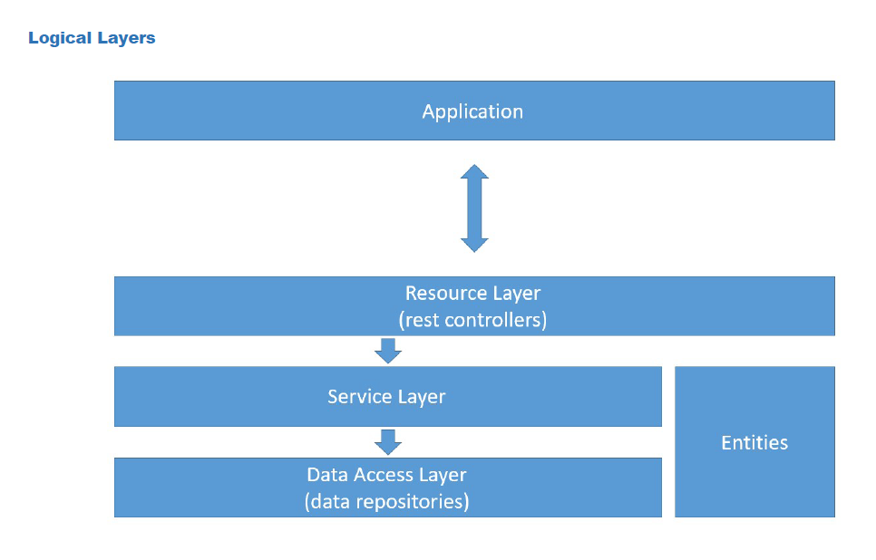

# web-services-spring-boot-JPA-hibernate

O projeto "web-services-spring-boot-JPA-hibernate" apresenta um aplicativo Java desenvolvido com o framework Spring Boot. O objetivo principal do projeto é criar um conjunto de web services para interações com um banco de dados, utilizando a tecnologia JPA (Java Persistence API) em conjunto com o Hibernate para mapeamento objeto-relacional. A estrutura do projeto é organizada em camadas lógicas, incluindo resource para as APIs, service para a lógica de negócios e repository para acesso ao banco de dados. O banco de dados de teste é configurado usando o H2, permitindo um ambiente de desenvolvimento ágil e independente. O projeto também inclui operações CRUD (Create, Retrieve, Update, Delete) para manipulação das entidades do modelo de domínio. Além disso, são implementados mecanismos de tratamento de exceções para garantir a robustez e a confiabilidade do sistema. O repositório visa fornecer uma base sólida para o desenvolvimento de web services, sendo uma opção interessante para desenvolvedores que desejam explorar as capacidades do Spring Boot em conjunto com o JPA e Hibernate.

Conforme a figura acima, o domain model é a estrutura geral e abstrata que define as classes de entidades e suas relações, enquanto na figura abaixo o domain instance são as instâncias concretas dessas classes que contêm dados que representam objetos específicos no sistema em tempo de execução. Essa distinção entre modelagem abstrata e dados concretos é essencial para uma arquitetura sólida e organizada no desenvolvimento de software e foi aplicada no projeto.

Conforme apresentado na figua abaixo, as camadas são utilizadas para uma arquitetura bem organizada e modular: a camada "Application" representa o núcleo da aplicação, enquanto a camada de "Resource Layer" (controladores REST) gerencia as requisições HTTP e interações com o mundo exterior; a camada de "Service Layers" abriga a lógica de negócio, e, por fim, a camada de "Data Access Layer" (repositórios de dados) cuida do acesso ao banco de dados, permitindo uma separação clara das responsabilidades e garantindo um sistema robusto e escalável.

Esse projeto foi desenvolvido a partir das aulas do curso de Java na Udemy, do professor Nélio Alves.
